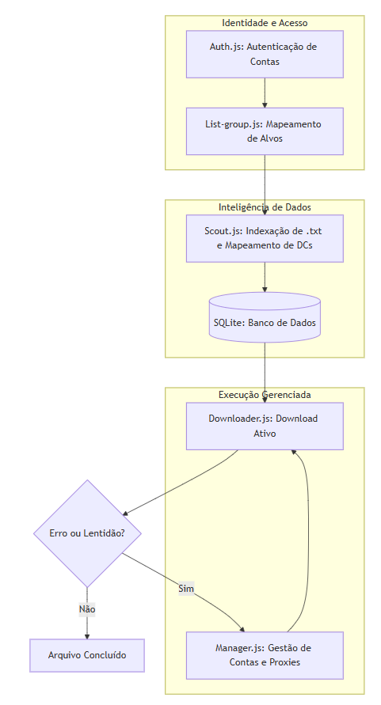

<table>
  <tr>
    <td></td>
    <td>O Leak Hunter é uma solução modular de engenharia de dados projetada para localizar, indexar e baixar arquivos .txt em larga escala dentro do ecossistema do Telegram. O foco central é a resiliência operacional e a eficiência geográfica, contornando as barreiras de segurança e tráfego da plataforma.</td>
  </tr>
</table>

1. Objetivo do Programa:
O sistema automatiza a "esteira de produção" de dados, transformando grupos privados e canais em fontes de dados estruturadas. Ele busca especificamente por ativos em formato de texto, organiza-os de acordo com a infraestrutura do Telegram e realiza o download de forma inteligente e distribuída.

2. Arquitetura e Fluxo de Trabalho:
A decisão de segregar o software em arquivos específicos não é apenas por organização, mas para garantir a Desacoplagem. Se o Telegram mudar a forma como lista grupos, apenas um script é afetado, mantendo o restante da operação intacta.

3. Estrutura de Módulos:
Auth.js (A Chave): Gerencia exclusivamente o protocolo de autenticação. Ele gera as sessões que permitem o acesso de múltiplas identidades sem a necessidade de re-login constante.

List-group.js (O Olheiro): Realiza o mapeamento de superfície. Ele identifica todos os grupos e canais aos quais as contas têm acesso, definindo os alvos da operação.

Scout.js (O Analista): Este é o cérebro da indexação. Ele varre as mensagens em busca de .txt, mas com um diferencial crítico: ele mapeia o Data Center (DC) de origem de cada mensagem, permitindo que o download seja otimizado para a região geográfica correta.

Downloader.js (O Executor): Responsável pelo I/O pesado. Ele consome a fila do banco de dados e realiza o download físico dos ativos.

Manager.js (O Gerente): Atua na camada de controle (Control Plane). Ele orquestra o rodízio de proxies e sessões, garantindo que a operação nunca pare por limites de um único IP ou conta.

4. Mapa Mental e Fluxo de Dados:

| Tecnologia        | Por que utilizamos?                                             | Problema que resolve                                                                 |
|------------------|------------------------------------------------------------------|---------------------------------------------------------------------------------------|
| Node.js          | Alta performance em operações assíncronas (I/O).                | Permite baixar múltiplos arquivos simultaneamente sem travar o sistema.              |
| GramJS (MTProto) | Protocolo nativo do Telegram.                                   | Maior estabilidade e limites de download superiores à API de bots convencional.      |
| SQLite3          | Banco de dados relacional leve.                                  | Garante que, se o PC desligar, o sistema saiba exatamente onde parou (Persistência). |
| SOCKS5 Proxies   | Isolamento de identidade de rede.                                | Evita que o IP real seja banido e permite simular acessos de diferentes localidades. |

 

5. Resiliência e Solução de Problemas
O projeto foi construído prevendo que o ambiente de extração é hostil. Abaixo, os principais desafios e como o software os vence:

⚠️ Problema: Rate Limiting (FloodWait)
O Telegram limita a quantidade de dados que uma conta pode puxar por segundo.

Solução: O Manager.js identifica o erro de "Flood" e automaticamente rotaciona para uma nova conta e um novo Proxy, mantendo a extração ativa enquanto a conta anterior "descansa".

⚠️ Problema: Fragmentação de Data Centers (DC)
Arquivos em DCs diferentes podem causar lentidão se o cliente não souber para onde pedir os dados.

Solução: O Scout.js pré-organiza as mensagens por DC no banco de dados. Isso permite que o Downloader.js se conecte ao servidor mais próximo do arquivo, reduzindo o tempo de resposta (handshake).

⚠️ Problema: IP Throttling
Múltiplas conexões vindas do mesmo IP residencial são rapidamente bloqueadas.

Solução: Uso de Proxies SOCKS5 dedicados em uma proporção de 1:1 por conta, garantindo que a reputação de uma conta não afete a outra.

Objetivo Final: Ter uma ferramenta "set-and-forget", onde você configura as sessões e o sistema cuida de toda a logística de extração, limpeza e download de forma autônoma.